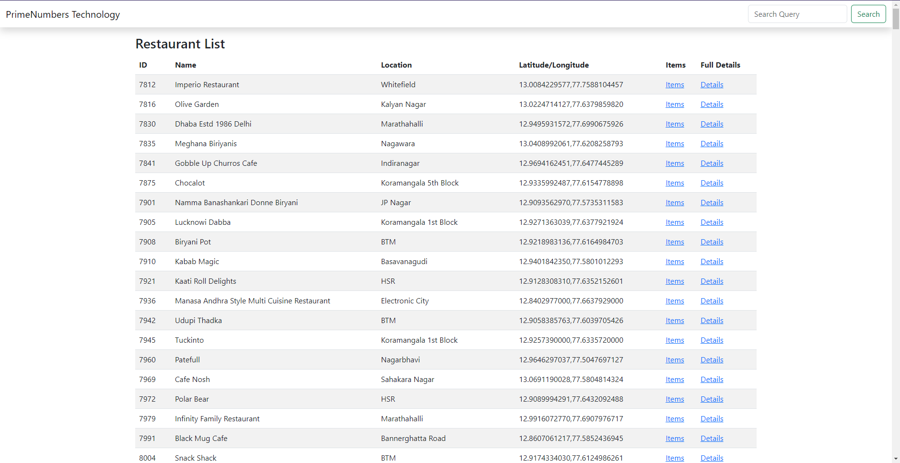
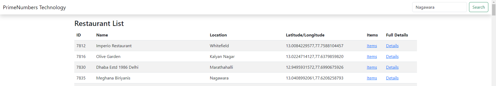
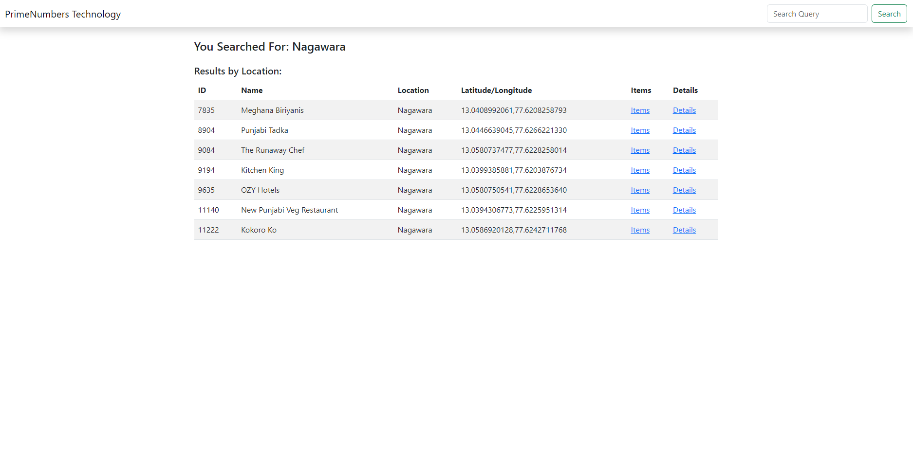
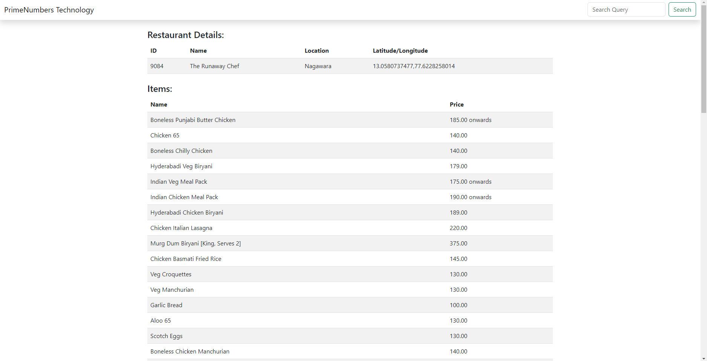
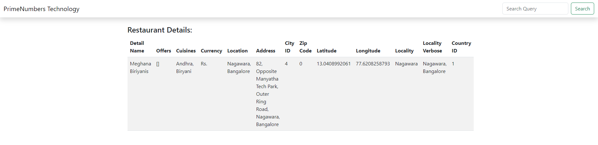

# Search-Query-Django


## Usage

To run the ProBlogs project locally, follow these steps:
1. Clone the repository:
   ```git clone  https://github.com/anishsingh42/Search-Query-Django.git```
2. Navigate to the project directory: cd Search-Query-Django
3. Install the required dependencies: ```pip install -r requirements.txt ```
4. Run database migrations: ``` python manage.py migrate ```
5. Start the development server: ``` python manage.py runserver ```
6. Access the application in your web browser: ``` python manage.py runserver ```


## Images of Application





